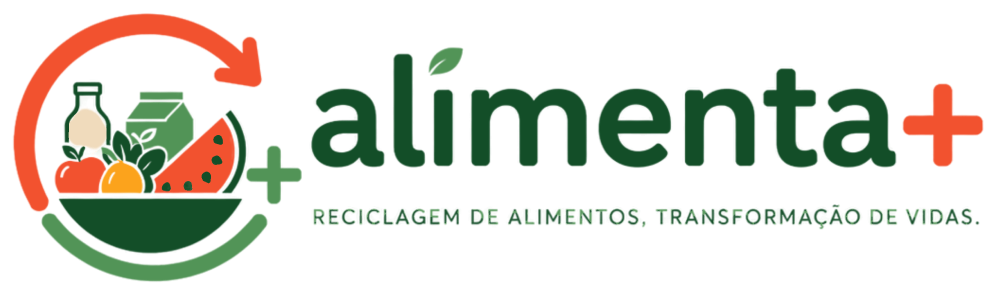

# 🥗 Alimenta+ — Menos desperdício, mais impacto

<p align="center">
  
</p>

<p align="center"><strong>Reciclagem de alimentos, transformação de vidas.</strong></p>


---

## 📋 Sobre o projeto

O **Alimenta+** é uma plataforma de impacto que conecta **estabelecimentos** que têm excedentes de alimentos (padarias, mercados, restaurantes...) a **pessoas que podem aproveitá-los** por um preço menor.

> _"Como transformar alimentos excedentes, ainda próprios para consumo, em uma oportunidade de economia para consumidores e de redução de perdas para os estabelecimentos?"_

Hoje o caminho do alimento costuma ser **produção → venda → excedente → descarte**. Com o Alimenta+, o excedente ganha um **novo destino**: o estabelecimento publica a oferta, o consumidor reserva pelo site e retira no local com um código. O consumidor economiza, o estabelecimento recupera parte do valor que iria para o lixo e o alimento não é desperdiçado.

O nome junta **alimentação + transformação e impacto**. O **"+"** significa mais valor, mais aproveitamento, mais economia, mais impacto e menos desperdício.

Este é o **projeto integrador do curso de Front-end Transforme-se da Serasa em parceria com o Instituto PROA**. Este repositório contém o **front-end**. Os dados vêm de uma API em .NET com banco SQL Server no Azure.

O projeto foi desenvolvido com foco em:

- **Protótipo no Figma** transformado em telas fiéis ao design (cores, tipografia e componentes);
- **HTML semântico e acessível** (`header`, `nav`, `main`, `section`, `article`, modais com `role="dialog"` e `aria-modal`, listas com `aria-live` e `label` nos campos dos formulários);
- **CSS organizado**: variáveis com a paleta da marca, um arquivo comum às áreas logadas e um arquivo por tela, classes em português no padrão BEM;
- **Layout responsivo** com Flexbox, CSS Grid e `@media` (do desktop ao celular);
- **JavaScript com módulos** (`import`/`export`) consumindo uma **API REST** com `fetch` e `async/await`;
- **Login com JWT**, com cada tela protegida pelo tipo de usuário (consumidor ou estabelecimento).

---

## 🌍 Por que o Alimenta+ existe

O desperdício de alimentos é um problema **ambiental, social e econômico**:

- 🌎 **No mundo:** cerca de **19%** dos alimentos disponíveis aos consumidores são desperdiçados no varejo, nos serviços de alimentação e nas residências.
- 🏙️ **Em São Paulo:** o Banco de Alimentos reaproveitou **826 toneladas** de alimentos entre 2025 e maio de 2026. Eles seriam descartados, mas ainda estavam próprios para consumo.
- 🛒 **No bolso do consumidor:** em junho de 2026 a cesta básica em São Paulo chegou a **R$ 965,47**.
- 💡 **Oportunidade:** o Ministério da Agricultura e a FAO apontam o aproveitamento de excedentes, a inovação e a economia circular como caminhos para reduzir perdas e gerar valor.

### 🎯 ODS abrangidos

| ODS | Objetivo                              |
| --- | ------------------------------------- |
| 2   | Fome Zero e Agricultura Sustentável   |
| 12  | Consumo e Produção Responsáveis       |
| 13  | Ação Contra a Mudança Global do Clima |

### 🧭 Missão, visão e valores

- **Missão:** conectar excedentes de alimentos a novos destinos, ajudando estabelecimentos a reduzir desperdícios e recuperar valor, enquanto oferece aos consumidores acesso a alimentos de forma mais econômica e consciente.
- **Visão:** construir uma rede onde nenhum excedente de alimento precise terminar automaticamente no descarte, tornando o aproveitamento uma prática natural, acessível e integrada à sociedade.
- **Valores:** aproveitamento, impacto, conexão, transparência, inovação e consciência.

---

## 🔍 Pesquisa de campo e persona

Fizemos um questionário online (Google Forms) sobre hábitos e percepções ligados ao desperdício de alimentos e obtivemos **mais de 50 respostas**.

- **77,2%** comprariam excedentes (38,6% com certeza e 38,6% provavelmente).
- **59,6%** usariam o Alimenta+ se ele já estivesse disponível (36,8% com certeza e 22,8% provavelmente).
- **63,2%** querem escolher exatamente o que comprar, e não receber uma "caixa surpresa".

**Persona:** jovem de 22 anos, que estuda, trabalha e mora na Zona Leste de São Paulo. Come fora de casa algumas vezes por semana, busca promoções em mercados, padarias e restaurantes e prioriza preço ao comprar por aplicativos e sites. Já ouviu falar de plataformas de excedentes, mas nunca usou. Para ela, informações sobre a validade são um fator decisivo.

### Da pesquisa para as telas

| O que o público disse                        | Como o Alimenta+ responde                                                                                  |
| -------------------------------------------- | ---------------------------------------------------------------------------------------------------------- |
| Preço/desconto é o que mais importa (82,5%)  | Cada oferta mostra o preço Alimenta+ ao lado do preço original riscado, e o detalhe mostra o % de desconto |
| Querem escolher os alimentos (63,2% e 52,6%) | Ofertas com descrição do que vem (ex.: "5 pães doces + 5 pães salgados"), busca e categorias               |
| Facilidade de uso (45,6%)                    | Reserva em dois cliques, com o código de retirada na hora                                                  |
| Informações sobre o estabelecimento (28,1%)  | O detalhe da oferta mostra o nome, o endereço e o horário de retirada                                      |
| Avaliações de outros consumidores (50,9%)    | Planejado no backlog ("Avaliações e notificações")                                                         |

---

## ⚙️ Como funciona

| 👤 Para o consumidor                                                             | 🏪 Para o estabelecimento                                                                          |
| -------------------------------------------------------------------------------- | -------------------------------------------------------------------------------------------------- |
| **1. Encontre o que procura:** veja as ofertas do dia com preços mais acessíveis | **1. Cadastre seus excedentes:** informe o alimento, a quantidade, o preço e o horário de retirada |
| **2. Reserve pelo site:** confira as informações e reserve de forma simples      | **2. Conecte-se a consumidores:** a oferta fica disponível para as pessoas reservarem              |
| **3. Retire e gere impacto:** retire no estabelecimento apresentando o código    | **3. Venda, economize e gere impacto:** confirme a retirada e acompanhe tudo no Dashboard          |

---

## ✨ Funcionalidades

### 🏠 Página inicial

- 🌱 Apresentação do Alimenta+, seus benefícios e o passo a passo de "Como funciona"
- 📊 **Impacto gerado** com números reais da plataforma vindos da API: alimentos salvos, kg reaproveitados e economia gerada para os estabelecimentos

### 🔐 Login e cadastro

- 🗂️ Abas **Entrar** e **Criar conta** (a página abre na aba certa com `?modo=login` ou `?modo=cadastro`)
- 📝 Cadastro de **consumidor** (nome, e-mail, CPF e senha) ou de **estabelecimento** (responsável, CPF, nome fantasia, CNPJ, categoria e endereço)
- ✅ Máscaras de CPF e CNPJ e senha forte (8+ caracteres, com maiúscula, minúscula, número e caractere especial)
- 💾 **Lembrar de mim:** mantém o usuário logado mesmo depois de fechar o navegador
- 🛡️ Cada tela confere o login: sem login volta para "Entrar", e um consumidor não acessa as telas do estabelecimento (nem o contrário)

### 👤 Área do consumidor

- 🔎 **Início:** ofertas do dia com **busca** (por produto, descrição ou estabelecimento) e **categorias** (Padaria, Hortifruti, Refeições e Bebidas)
- 🧾 **Detalhe da oferta:** preço, desconto, estabelecimento, endereço, horário de retirada e quantas unidades restam
- 🎟️ **Reserva:** gera na hora um **código de retirada de 6 dígitos**
- 📅 **Minhas reservas:** produto, estabelecimento, data, código e status. Dá para **cancelar** enquanto a reserva aguarda retirada, e a unidade volta para a oferta
- ⚙️ **Perfil:** dados da conta, alterar senha, e-mail e celular, e excluir a conta

### 🏪 Área do estabelecimento

- 📈 **Dashboard:**
  - Indicadores do dia: reservas feitas, retiradas, aguardando retirada e alimentos salvos
  - Impacto do mês: itens salvos, kg de descarte evitado e pessoas atendidas
  - **Receita recuperada** no mês, comparada com o mês anterior
  - **Gráfico** dos últimos 6 meses (reservas × retiradas)
  - Últimas reservas
- 🏷️ **Minhas ofertas:**
  - Publicar uma oferta: nome, descrição, preços, quantidade, categoria, horário de retirada (digitar `2130` vira `21:30`) e peso estimado por unidade
  - Tabela com paginação e o status de cada oferta
  - Menu ⋮ para **alterar estoque**, **ativar/inativar** e **excluir**. Só é possível excluir uma oferta sem reservas; a oferta com reservas pode ser inativada
- 📋 **Reservas:**
  - Reservas agrupadas por oferta, com o resumo da oferta
  - Cada reserva mostra o cliente, a data, o código e o status
  - **Alterar status** (Aguardando retirada / Retirada / Cancelada) e **cancelar reserva**
- ⚙️ **Perfil:** dados da conta e do estabelecimento, alterar senha, e-mail, celular, nome fantasia, endereço e categoria, e excluir a conta

### 📱 Para todas as telas

- 📱 **Layout responsivo**: no celular o menu lateral vira menu "hambúrguer" e a tabela de ofertas vira cartões
- ⌨️ **Acessível pelo teclado**: ofertas abrem com Enter/Espaço, e `Esc` fecha modais e menus
- 💬 Mensagens de erro e de sucesso dentro dos formulários, com o texto que vem da API

---

## 🗂️ Telas

| Área            | Tela                                                                | Caminho                               |
| --------------- | ------------------------------------------------------------------- | ------------------------------------- |
| Pública         | Página inicial                                                      | `index.html`                          |
| Pública         | Entrar / Criar conta                                                | `pags/login/index.html`               |
| Consumidor      | Início (ofertas e reserva)                                          | `pags/consumidor/inicio/`             |
| Consumidor      | Minhas reservas                                                     | `pags/consumidor/minhasReservas/`     |
| Consumidor      | Perfil                                                              | `pags/consumidor/perfil/`             |
| Consumidor      | Alterar senha, e-mail e celular                                     | `pags/consumidor/alterar*/`           |
| Consumidor      | Excluir conta                                                       | `pags/consumidor/excluirConta/`       |
| Estabelecimento | Dashboard                                                           | `pags/estabelecimento/dashboard/`     |
| Estabelecimento | Minhas ofertas                                                      | `pags/estabelecimento/minhasOfertas/` |
| Estabelecimento | Reservas                                                            | `pags/estabelecimento/reservas/`      |
| Estabelecimento | Perfil                                                              | `pags/estabelecimento/perfil/`        |
| Estabelecimento | Alterar senha, e-mail, celular, nome fantasia, endereço e categoria | `pags/estabelecimento/alterar*/`      |
| Estabelecimento | Excluir conta                                                       | `pags/estabelecimento/excluirConta/`  |

### Status mostrados nas telas

| Oferta     | Quando aparece                                               |
| ---------- | ------------------------------------------------------------ |
| Disponível | Publicada hoje, com unidades e dentro do horário de retirada |
| Esgotada   | Não há mais unidades disponíveis                             |
| Expirada   | Passou do dia da publicação ou do horário de retirada        |
| Inativa    | O estabelecimento tirou a oferta do ar                       |

| Reserva             | Quando aparece                                    |
| ------------------- | ------------------------------------------------- |
| Aguardando retirada | Reserva feita, ainda não retirada                 |
| Retirada            | O estabelecimento confirmou a retirada            |
| Cancelada           | Cancelada pelo consumidor ou pelo estabelecimento |

---

## 📊 Como o impacto é medido

Na apresentação definimos uma meta para cada tipo de impacto. Veja onde cada uma aparece no sistema:

| Impacto      | Meta                                                                    | Onde aparece                                                                                                          |
| ------------ | ----------------------------------------------------------------------- | --------------------------------------------------------------------------------------------------------------------- |
| 🌱 Ambiental | kg de alimento resgatado, informado pelo estabelecimento em cada oferta | Campo "Peso estimado por unidade" da oferta → "Descarte evitado" no Dashboard e "kg reaproveitados" na página inicial |
| 💰 Econômico | R$ economizados pelo consumidor e R$ recuperados pelo estabelecimento   | Desconto de cada oferta → "Receita recuperada" no Dashboard e "Economia gerada" na página inicial                     |
| 🤝 Social    | Número de reservas retiradas                                            | "Reservas retiradas", gráfico de retiradas e "Pessoas atendidas" no Dashboard                                         |

Os números de impacto contam **só reservas retiradas**, porque uma reserva cancelada não salvou nenhum alimento.

---

## 🎨 Identidade visual

Tipografia: **Poppins** (Google Fonts). As cores ficam como variáveis em `css/global.css`:

| Cor                                                      | Hex       | Variável CSS       | Significado / uso                                            |
| -------------------------------------------------------- | --------- | ------------------ | ------------------------------------------------------------ |
|  | `#F2522F` | `--laranja`        | Energia, ação, alimentação e acolhimento; botões e destaques |
|  | `#2F7634` | `--verde-floresta` | Sustentabilidade e natureza                                  |
|  | `#529457` | `--verde-folha`    | Equilíbrio e responsabilidade                                |
|  | `#E7EFE0` | `--verde-claro`    | Fundo do menu lateral e selos                                |
|  | `#FFFBF3` | `--creme`          | Fundo das páginas e cartões                                  |
|  | `#18341E` | `--verde-escuro`   | Textos, títulos e bordas                                     |
|  | `#172B4D` | `--azul-marinho`   | Textos de apoio                                              |

O contraste entre cores quentes e frias cria uma identidade dinâmica e acolhedora, que conecta alimentação, sustentabilidade e impacto positivo.

---

## 🧠 JavaScript utilizado

| Recurso                                                | Onde é usado                                                                |
| ------------------------------------------------------ | --------------------------------------------------------------------------- |
| `import` / `export` (módulos ES)                       | `api.js`, `formatar.js` e `painel.js` são compartilhados por todas as telas |
| `fetch` + `async` / `await` + `try` / `catch`          | `chamarApi()` em `js/api.js`, usada em todas as chamadas à API              |
| `localStorage` / `sessionStorage`                      | Token do login ("Lembrar de mim") e endereço da API                         |
| `atob` + `JSON.parse`                                  | Ler o token JWT (tipo de usuário e validade) para proteger as telas         |
| Template strings + `innerHTML` + `map().join("")`      | Montar cards, tabelas e listas com os dados da API                          |
| `addEventListener` com delegação (`closest`)           | Cliques em cards, menus ⋮ e botões criados dinamicamente                    |
| `classList`, `hidden` e `dataset`                      | Abrir modais, menus e grupos; guardar o id de cada item no botão            |
| `filter`, `find`, `slice`, `flatMap`                   | Busca, categorias, paginação e "ver mais"                                   |
| `FormData` e `URLSearchParams`                         | Ler os formulários e abrir o login na aba certa                             |
| `toLocaleString("pt-BR")` com fuso `America/Sao_Paulo` | Moeda, números, datas e horários                                            |
| `createElementNS` (SVG) + `ResizeObserver`             | Gráfico de linhas do Dashboard, redesenhado quando a tela muda de tamanho   |

---

## 🔌 Integração com a API

O front conversa com a API do AlimentaMais (API privada):

- API REST em **C# / ASP.NET Core**, no padrão Controller → UseCase → Repository;
- **Entity Framework Core** para acessar o banco;
- **JWT** no login e senhas guardadas com **BCrypt**;
- Banco **SQL Server (Azure SQL)** com as tabelas `usuario`, `estabelecimento`, `oferta` e `reserva`, e a view `vw_impacto`.

| Tela                             | Endpoints                                                                                                         |
| -------------------------------- | ----------------------------------------------------------------------------------------------------------------- |
| Página inicial (Impacto gerado)  | `GET /api/impacto`                                                                                                |
| Entrar / Criar conta             | `POST /hlm/login`, `POST /api/usuario`                                                                            |
| Consumidor - Início              | `GET /api/ofertas`, `POST /api/reservas`                                                                          |
| Consumidor - Minhas reservas     | `GET /api/reservas`, `PATCH /api/reservas/{id}/cancelar`                                                          |
| Estabelecimento - Dashboard      | `GET /api/estabelecimento/dashboard`                                                                              |
| Estabelecimento - Minhas ofertas | `GET` e `POST /api/estabelecimento/ofertas`, `PATCH .../{id}/estoque`, `PATCH .../{id}/status`, `DELETE .../{id}` |
| Estabelecimento - Reservas       | `GET /api/estabelecimento/reservas`, `PATCH /api/estabelecimento/reservas/{id}/status`                            |
| Perfil (os dois)                 | `GET /api/perfil`                                                                                                 |
| Alterar dados e excluir conta    | `PATCH /api/perfil`, `PATCH /api/perfil/senha`, `DELETE /api/perfil`                                              |

O endereço da API fica em `js/api.js`. Se a API responder que o login venceu (erro 401), o usuário volta para a tela de login.

---

## 📁 Estrutura do projeto

```text
AlimentaMais-Frontend/
├── index.html                      Página inicial
├── css/
│   ├── global.css                  Reset e paleta de cores (variáveis)
│   ├── painel.css                  Menu lateral, cabeçalho, formulários, botões e modais das áreas logadas
│   ├── index.css
│   ├── login.css
│   ├── consumidor/                 inicio.css, minhasReservas.css
│   └── estabelecimento/            dashboard.css, minhasOfertas.css, reservas.css
├── js/
│   ├── api.js                      Endereço da API, token do login e chamarApi()
│   ├── formatar.js                 Moeda, datas, status e categorias
│   ├── painel.js                   Comum às telas logadas: proteção, nome do usuário, menu mobile e "Sair"
│   ├── index.js                    Números do "Impacto gerado"
│   ├── perfil.js                   Telas de perfil
│   ├── alterarDados.js             Telas "Alterar ..." e "Excluir conta"
│   ├── login/                      script.js, components/, services/, utils/
│   ├── consumidor/                 inicio.js, minhasReservas.js
│   └── estabelecimento/            dashboard.js, minhasOfertas.js, reservas.js
├── imagens/
│   ├── logos/
│   ├── icones/
│   └── img/
└── pags/
    ├── login/index.html
    ├── consumidor/
    │   ├── inicio/  minhasReservas/  perfil/
    │   └── alterarSenha/  alterarEmail/  alterarCelular/  excluirConta/
    └── estabelecimento/
        ├── dashboard/  minhasOfertas/  reservas/  perfil/
        └── alterarSenha/  alterarEmail/  alterarCelular/  alterarNomeFantasia/
            alterarEndereco/  alterarCategoria/  excluirConta/
```

Cada tela fica em `pags/<área>/<tela>/index.html`.

---

## 🚀 Como executar

1. Clone ou baixe este repositório.
2. Abra a pasta no **VS Code** e inicie o **Live Server** no `index.html`. A porta 5501 já está configurada em `.vscode/settings.json`.
3. Crie uma conta ou entre com uma das contas de demonstração abaixo.

### 🔑 Contas de demonstração

| Tipo            | E-mail                        |
| --------------- | ----------------------------- |
| Estabelecimento | `padaria.saojoao@exemplo.com` |
| Consumidor      | `marcelo.alves@exemplo.com`   |

Senha das contas de demonstração: `Senha@123`

> ⚠️ A API só aceita chamadas dos endereços liberados no CORS do backend: `http://localhost:5500`, `http://127.0.0.1:5500`, `http://localhost:5501`, `http://127.0.0.1:5501` e `https://will-ribeiro00.github.io`.

---

## 🗺️ Backlog e próximos passos

| Funcionalidade                                   | Fase (apresentação) | Situação                |
| ------------------------------------------------ | ------------------- | ----------------------- |
| Login e cadastro                                 | MVP                 | ✅ Pronto               |
| Estabelecimento cria oferta                      | MVP                 | ✅ Pronto               |
| Consumidor reserva oferta                        | MVP                 | ✅ Pronto               |
| Retirada com código                              | MVP                 | ✅ Pronto               |
| Perfil e alteração de dados                      | Próxima versão      | ✅ Adiantado para o MVP |
| Dashboard para o estabelecimento                 | Próxima versão      | ✅ Adiantado para o MVP |
| Pagamento online (Pix)                           | Próxima versão      | 🔜 Planejado            |
| Avaliações e notificações                        | Próxima versão      | 🔜 Planejado            |
| Delivery (integração com Maps e apps de entrega) | Futuro              | 🔜 Planejado            |
| Gamificação                                      | Futuro              | 🔜 Planejado            |
| Plano premium e parcerias                        | Futuro              | 🔜 Planejado            |
| Expansão para outras regiões                     | Futuro              | 🔜 Planejado            |

---

## ⚠️ Limitações atuais

- Ainda **não há pagamento online**: a reserva garante a unidade e gera o código de retirada (o Pix está na próxima versão).
- Cada reserva vale **1 unidade**. Para levar mais, o consumidor faz mais de uma reserva.
- As ofertas valem **só no dia da publicação**, até o horário de retirada. Depois disso aparecem como "Expirada".
- As ofertas não têm foto: cada uma usa o ícone da sua categoria.
- Os mini-games, pontos e níveis citados na página inicial ainda não foram implementados (gamificação está no futuro do backlog).
- "Esqueci minha senha" e os links do rodapé (Sobre nós, Carreiras, Contato, Termos de uso, Privacidade e redes sociais) ainda não levam a nenhuma página.
- O login expira em **60 minutos**; depois é preciso entrar de novo.
- O site depende da API: se ela estiver fora do ar, as telas logadas mostram uma mensagem de erro e a página inicial mostra números de exemplo.
- Ainda **não há geolocalização**: o Início mostra todas as ofertas do dia, não só as mais próximas.

---

## 👥 Equipe

Feito com ❤️ pela equipe **Alimenta+**.

<div align="center">
<table>
<tr>
<td align="center" width="25%">

<br />
<strong>Lincoln Almeida</strong>
<br />
Product Owner
</td>
<td align="center" width="25%">

<br />
<strong>Gabriel Aguilar</strong>
<br />
Scrum Master
</td>
<td align="center" width="25%">

<br />
<strong>Ana Julia</strong>
<br />
UI/UX Design
</td>
<td align="center" width="25%">

<br />
<strong>Iohana Freitas</strong>
<br />
UI/UX Design
</td>
</tr>
<tr>
<td align="center" width="25%">

<br />
<strong>Kauã Leandro</strong>
<br />
Desenvolvedor Backend
</td>
<td align="center" width="25%">

<br />
<strong>Flavia Santos</strong>
<br />
Desenvolvedor Backend
</td>
<td align="center" width="25%">

<br />
<strong>Williansberg Ribeiro</strong>
<br />
Desenvolvedor Fullstack
</td>
</tr>
</table>
</div>

---


## 🙏 Agradecimentos

- Professor **Nicolas Euflauzino**
- Professor **Felipe Leite**
- **Instituto PROA**
- **Serasa Experian**

---

## 📚 Referências

<details>
<summary>Ver as referências usadas na pesquisa e na apresentação</summary>

- ASSOCIAÇÃO BRASILEIRA DE SUPERMERCADOS (ABRAS). _20ª avaliação de perdas no varejo brasileiro de supermercados._ São Paulo, 2020. Disponível em: https://www.abras.com.br/economia-e-pesquisa/pesquisa-de-perdas/pesquisa-2020. Acesso em: 2 out. 2026.
- ASSOCIAÇÃO BRASILEIRA DE SUPERMERCADOS (ABRAS). _21ª avaliação de perdas no varejo brasileiro de supermercados._ São Paulo, 2021. Disponível em: https://www.abras.com.br/economia-e-pesquisa/pesquisa-de-eficiencia-operacional/pesquisa-2021. Acesso em: 2 out. 2026.
- ASSOCIAÇÃO MINEIRA DE SUPERMERCADOS (AMIS). _Quebras operacionais exigem mais atenção para evitar prejuízos nos supermercados._ Belo Horizonte, 26 abr. 2021. Disponível em: https://amis.org.br/quebras-operacionais-exigem-mais-atencao-para-evitar-prejuizos-nos-supermercados/. Acesso em: 2 out. 2026.
- BLUESOFT. _O que é quebra operacional e por que você deveria se preocupar?_ 25 jul. 2025. Disponível em: https://blog.bluesoft.com.br/o-que-e-quebra-operacional-e-por-que-voce-deveria-se-preocupar/. Acesso em: 2 out. 2026.
- BRASIL. Ministério da Agricultura e Pecuária. _Perdas e desperdício de alimentos._ Disponível em: https://www.gov.br/agricultura/pt-br/assuntos/sustentabilidade/perdas-e-desperdicio-de-alimentos. Acesso em: 2 out. 2026.
- COMPANHIA NACIONAL DE ABASTECIMENTO (CONAB). _Custo da cesta básica registra queda de preços em 10 capitais brasileiras._ Brasília, DF, 8 jul. 2026. Disponível em: https://www.gov.br/conab/pt-br/assuntos/noticias/custo-da-cesta-basica-registra-queda-de-precos-em-10-capitais-brasileiras. Acesso em: 2 out. 2026.
- ENTRE SOLOS. _Desperdício de alimentos: como estamos?_ 7 jun. 2023. Disponível em: https://www.entresolos.org.br/desperdicio-de-alimentos-como-estamos/. Acesso em: 2 out. 2026.
- FOOD AND AGRICULTURE ORGANIZATION OF THE UNITED NATIONS (FAO). _On the International Day of Awareness of Food Loss and Waste, FAO highlights the power of data to reduce food loss and waste._ 29 set. 2026. Disponível em: https://www.fao.org/statistics/highlights-archive/highlights-detail/on-the-international-day-of-awareness-of-food-loss-and-waste--learn-how-fao-is-leveraging-data-to-save-food-and-advance-the-2030-agenda-2026/en. Acesso em: 2 out. 2026.
- FOOD AND AGRICULTURE ORGANIZATION OF THE UNITED NATIONS (FAO). _Reducing food loss and waste to protect forests and transform agrifood systems._ 29 set. 2026. Disponível em: https://www.fao.org/newsroom/detail/reducing-food-loss-and-waste-to-protect-forests-and-transform-agrifood-systems/en. Acesso em: 2 out. 2026.
- NAÇÕES UNIDAS BRASIL. _Mundo joga fora mais de 1 bilhão de refeições por dia._ 29 set. 2026. Disponível em: https://brasil.un.org/pt-br/323505-mundo-joga-fora-mais-de-1-bilh%C3%A3o-de-refei%C3%A7%C3%B5es-por-dia. Acesso em: 2 out. 2026.
- PROGRAMA DAS NAÇÕES UNIDAS PARA O MEIO AMBIENTE (PNUMA). _Food Waste Index Report 2024._ Nairobi: United Nations Environment Programme, 2024. Disponível em: https://www.unep.org/resources/publication/food-waste-index-report-2024. Acesso em: 2 out. 2026.
- RIBEIRO, Jéssica Souza. _Indicadores de desperdício de alimentos em restaurantes comerciais [Brasil]._ Rosa dos Ventos – Turismo e Hospitalidade, v. 12, n. 2, p. 350-365, 2020. DOI: https://doi.org/10.18226/21789061.v12i2p350. Disponível em: https://sou.ucs.br/etc/revistas/index.php/rosadosventos/article/view/7379. Acesso em: 2 out. 2026.
- SÃO PAULO (Município). Secretaria Executiva de Segurança Alimentar e Nutricional e de Abastecimento. _Dia Mundial da Segurança dos Alimentos: saiba como o Banco de Alimentos realiza suas triagens e conseguiu reaproveitar mais de 826 toneladas de alimentos._ São Paulo, jun. 2026. Disponível em: https://prefeitura.sp.gov.br/web/sesana/w/dia-mundial-da-seguran%C3%A7a-dos-alimentos-saiba-como-o-banco-de-alimentos-realiza-suas-triagens-e-conseguiu-reaproveitar-mais-de-826-toneladas-de-alimentos. Acesso em: 2 out. 2026.

</details>

---

> ℹ️ Projeto acadêmico, sem fins lucrativos, desenvolvido como projeto integrador do curso de Front-end Transforme-se da Serasa em parceria com o Instituto PROA. Os estabelecimentos, usuários e ofertas das contas de demonstração são fictícios. Ícones: [Font Awesome](https://fontawesome.com/). Fonte: [Poppins](https://fonts.google.com/specimen/Poppins) (Google Fonts).
